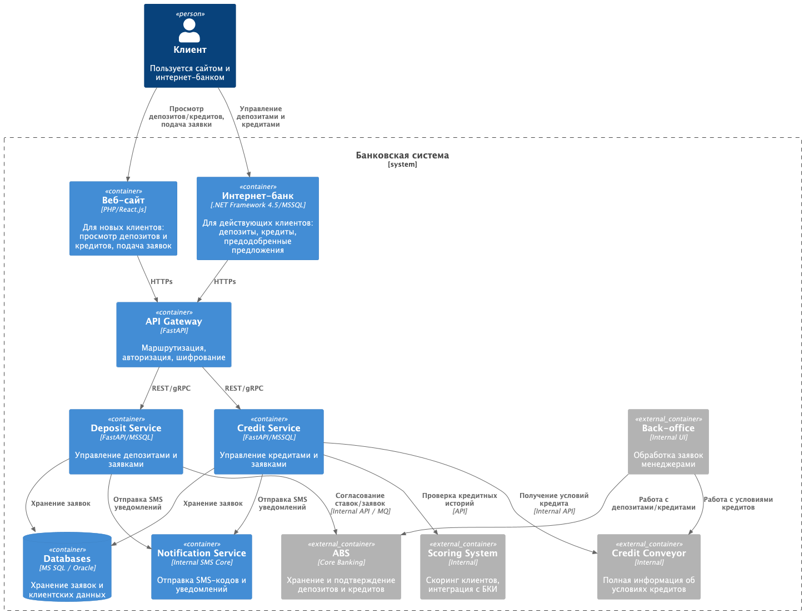

### **Название задачи:** Открытие депозитов онлайн
### **Автор:** Амочкин Александар Владимирович
### **Дата:** 02.09.2025
### **Функциональные требования**
Use Cases:

| **№** | **Действующие лица или системы**                                                                                                                                                                                                                                                                                                                          | **Use Case**                              | **Описание**                                                                                                                                                                                                                                                                                            |
|:-----:|:----------------------------------------------------------------------------------------------------------------------------------------------------------------------------------------------------------------------------------------------------------------------------------------------------------------------------------------------------------|:------------------------------------------|:--------------------------------------------------------------------------------------------------------------------------------------------------------------------------------------------------------------------------------------------------------------------------------------------------------|
|   1   | 1. Клиент (новый) — использует сайт банка.  2. Клиент (действующий) — использует интернет-банк (ИБ). 3. Менеджер кол-центра — обрабатывает заявки с сайта. 4. Менеджер бэк-офиса — подтверждает условия и открывает депозит. 5. АБС — система обработки депозитов и учёта. 6. СМС-шлюз — отправляет коды подтверждения и уведомления. | Просмотр доступных депозитов              | 1. Клиент открывает сайт или ИБ. 2. Система отображает список депозитов и актуальные ставки. 3.В ИБ клиент дополнительно видит персонализированные ставки.                                                                                                                                      |
|   2   |                                                                                                                                                                                                                                                                                                                                                           | Подача заявки новым клиентом (сайт)       | 1. Клиент выбирает депозит.  2. Вводит Ф.И.О. и номер телефона. 3. Система сохраняет заявку и передаёт её в кол-центр.  4. Клиенту отображается сообщение о принятии заявки. 5. Клиент получает СМС о том, что менеджер свяжется.                                                       |
|   3   |                                                                                                                                                                                                                                                                                                                                                           | Обработка заявки менеджером кол-центра    | 1. Менеджер открывает систему и видит новую заявку. 2. Связывается с клиентом. 3. Может предложить особые условия (фиксируется в заявке). 4. Заявка передаётся на обработку в бэк-офис.                                                                                                     |
|   4   |                                                                                                                                                                                                                                                                                                                                                           | Подача заявки действующим клиентом (ИБ)   | 1.Клиент авторизуется в ИБ. 2. Выбирает депозит, указывает счёт и сумму. 3. Система формирует заявку и запрашивает подтверждение через СМС. 4. Клиент вводит код из СМС. 5. Система сохраняет заявку и передаёт её в бэк-офис. 6. Клиент получает уведомление, что заявка принята.  |
|   5   |                                                                                                                                                                                                                                                                                                                                                           | Обработка заявки менеджером бэк-офиса     | 1. Менеджер видит заявку (с сайта или ИБ). 2. Проверяет условия (ставка, сумма, счёт).  3. Подтверждает депозит в АБС.  4.Система фиксирует результат и отправляет уведомления клиенту.                                                                                                     |
|   6   |                                                                                                                                                                                                                                                                                                                                                           | Уведомление клиента                       | 1. После подтверждения условий клиент получает СМС с информацией о ставке. 2. После открытия депозита клиент получает СМС о подтверждении открытия.                                                                                                                                                 |
|   7   |                                                                                                                                                                                                                                                                                                                                                           | Идентификация нового клиента в отделении  | 1. Новый клиент приходит в отделение. 2. Менеджер проводит идентификацию (KYC). 3. После успешной идентификации депозит открывается в АБС. 4. Клиент получает СМС-уведомление об открытии депозита.                                                                                         |

### **Нефункциональные требования**
Опишите здесь нефункциональные требования и архитектурно значимые требования.

| **№** | **Требование**                                                                                                                                |
|:-----:|:----------------------------------------------------------------------------------------------------------------------------------------------|
|   1   | Время отклика пользовательских операций:  p95 ≤ 300–500 мс (интернет-банк, сайт).   Массовая загрузка справочников/списков — ≤ 1 сек. |
|   2   | Скоринг кредита для новых клиентов — не более 5 секунд.                                                                                       |
|   3   | Поддержка горизонтального масштабирования для онлайн-сервисов.                                                                                |
|   4   | SLA доступности: ≥ 99,9% для интернет-банка и сайтов.                                                                                         |
|   5   | 24/7 работа сервисов.                                                                                                                         |
|   6   | Два ЦОД: резервирование и переключение при сбое.                                                                                              |
|   7   | Поддержка горизонтального масштабирования фронтов и микросервисов; АБС — только вертикально.                                                  |
|   8   | Шифрование трафика (TLS 1.2+).                                                                                                                |
|   9   | Маскирование чувствительных данных в логах.                                                                                                   |
|  10   | Аутентификация: интернет-банк — сессии, подтверждения через СМС.                                                                              |
|  11   | Соответствие требованиям регулятора (KYC, работа с ПДн, идентификация).                                                                       |
|  12   | Использование технологий с уже существующей экспертизой (MS SQL, Oracle, текущие языки разработки).                                           |
|  13   | Документация: архитектурные схемы, API, регламенты.                                                                                           |
|  14   | Интернет-банк и сайт не должны напрямую нагружать АБС.                                                                                        |
|  15   | Использовать интеграционный слой (API-шлюз, шина сообщений, брокер).                                                                          |
|  16   | СМС-шлюз ядра (обязателен).                                                                                                                   |
|  17   | Скоринг (кредитное направление обязателен).                                                                                                   |

### **Решение**

Для реализации новых сервисов были выбраны технологии из ряда уже использующихся в банке: python, MySQL, ...
Python позволяет быстро вести разработку новых сервисов для MVP. А на рынке труда много программистов им владеющих.
Использование 1 языка программирования позволит увеличить пере-использование кода. Один раз реализовать все повторяющиеся задачи для микросервисов: 
модуль логирование (loguru), модули мониторинга (prometheus, sentry) и т. д. 
В новых микро-сервисах просто использовать уже готовые модули.   

### **Альтернативы**
#### 1. Архитектура интеграций
Выбранное решение: API Gateway + промежуточные микросервисы (Deposits, Credits), без прямого доступа интернет-банка к АБС.
Альтернатива:
Использовать ESB/ESB-lite (Enterprise Service Bus) вместо набора микросервисов.  
Плюсы: централизованная интеграция, меньше дублирования логики.  
Минусы: риск создать «монолитную шину», трудно масштабировать, устаревающий подход.
#### 2. Обработка ставок и условий
Выбранное решение: хранение ставок по депозитам в XLS → в перспективе перевод в ABS.
Альтернатива:
Сразу вынести ставки в отдельный сервис “Rates Service”.  
Плюсы: единый источник правды для депозитов и кредитов, меньше ручных ошибок.  
Минусы: дополнительные затраты на разработку, дублирование процессов ABS.

**Недостатки, ограничения, риски**

* Нужно использовать MS SQL / Oracle, Kafka «на перспективу», только те технологии, где уже есть экспертиза. Это ограничивает свободу выбора архитектурных решений.
* Наличие резервного ЦОД
* Интернет-банк пока работает в одном ЦОД, и переключение возможно только вручную. Это снижает уровень доступности.
* Запрещены прямые вызовы из интернет-банка → всё должно проходить через промежуточные сервисы.
* Текущая версия несовместима с Kafka, что накладывает ограничения на асинхронный обмен.
* Обязательная офлайн-идентификация новых клиентов, поэтому процесс нельзя полностью цифровизовать.
* При росте онлайн-заявок возможна деградация работы всей системы банка.
* Недостижимость SLA 99,9%. Интернет-банк пока не готов к высоким требованиям по доступности → риск невыполнения бизнес-ожиданий.
* Передача чувствительной информации через сайт требует строгого контроля (TLS, защита логов, аудит). Ошибки могут привести к утечке ПДн и штрафам.
* Разнородный стек (старые системы + новые микросервисы) → возрастает риск технического долга и проблем при расширении.

