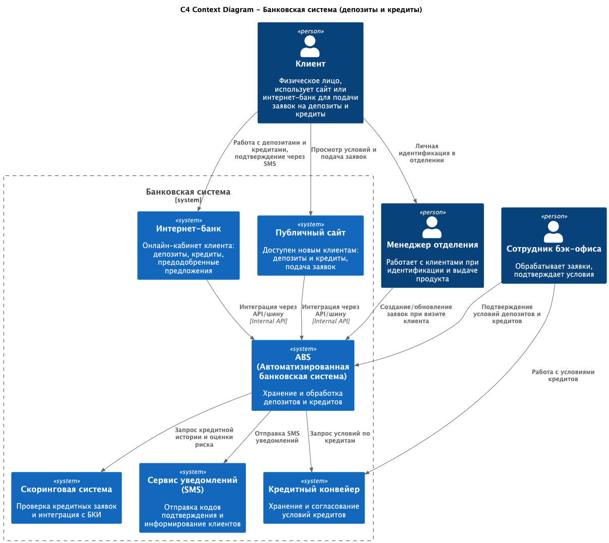

### **Название задачи:** 
### **Автор:**
### **Дата:**
### **Функциональные требования**
Опишите здесь верхнеуровневые Use Cases. Их нужно оформить в виде таблицы с пошаговым описанием:

| **№** | **Действующие лица или системы** | **Use Case**                                                | **Описание**                                                                                                                                                                                                   |
|:-----:|:---------------------------------|:------------------------------------------------------------|:---------------------------------------------------------------------------------------------------------------------------------------------------------------------------------------------------------------|
|   1   | Клиент (новый или действующий)   | Просмотр доступных депозитов/счетов                         | 1. Клиент заходит в интернет-банк или на сайт. 2.Система показывает список депозитов/счетов с актуальными ставками. 3.Для действующего клиента отображаются персонализированные ставки.                |
|   2   | Действующий клиент               | Подача заявки на депозит/накопительный счёт (интернет-банк) | 1. Клиент отправляет заявку через интернет-банк. 2.Система проверяет корректность данных. 3.Система автоматически создаёт запись в ABS. 4.Клиент получает СМС об успешном открытии депозита/счёта. |
|   3   | Клиент                           | Просмотр доступных кредитов                                 | 1. Клиент открывает сайт или интернет-банк. 2. Система показывает список кредитов и актуальные ставки. 3.(Интернет-банк) Клиент может видеть предодобренное предложение.                               |

### **Нефункциональные требования**
Опишите здесь нефункциональные требования и архитектурно значимые требования.

| **№** | **Требование**                                                                                                                                                                                 |
|:-----:|:-----------------------------------------------------------------------------------------------------------------------------------------------------------------------------------------------|
|   1   | Время отклика клиентских операций — < 1 секунды, валидации и расчёты ставок — в миллисекундах.                                                                                                 |
|   2   | Решение по кредиту должно предоставляться в течение 1 рабочего дня (при наличии всех данных).                                                                                                  |
|   3   | Интернет-банк и API Gateway должны поддерживать горизонтальное масштабирование.                                                                                                                |
|   4   | ABS остаётся вертикально масштабируемой, поэтому нагрузка на неё должна быть минимизирована за счёт сервисного слоя и кэширования.                                                             |
|   5   | Кредитный конвейер и скоринг должны масштабироваться горизонтально.                                                                                                                            |
|   6   | В случае отказа ЦОД должно быть обеспечено автоматическое переключение на резервный.                                                                                                           |
|   7   | Сервисы интернет-банка должны быть доступны 24/7 с SLA 99,9%.                                                                                                                                  |
|   8   | Архитектура должна поддерживать легкое добавление новых продуктов (например, инвестиции, страхование).                                                                                         |
|   9   | Повторное использование технологий, которые уже есть в банке (MS SQL, Oracle, Kafka в перспективе).                                                                                            |
|  10   | Все каналы (сайт, интернет-банк, мобильное приложение, кол-центры) должны работать через единый API Gateway.                                                                                   |
|  11   | Поддержка асинхронных сценариев (например, через kafka).                                                                                                                                       |
|  12   | Поддержка расширения на push-уведомления (в мобильном банке).                                                                                                                                  |

### **Решение**
 

Для реализации новых сервисов были выбраны технологии из ряда уже использующихся в банке: python, MySQL, ...
Python позволяет быстро вести разработку новых сервисов для MVP. А на рынке труда много программистов им владеющих.
Использование 1 языка программирования позволит увеличить пере-использование кода. Один раз реализовать все повторяющиеся задачи для микросервисов: 
модуль логирование (loguru), модули мониторинга (prometheus, sentry) и т. д. 
В новых микро-сервисах просто использовать уже готовые модули.  

### **Альтернативы**
1. **Прямая интеграция интернет-банка и ABS**  
   Описание: интернет-банк напрямую работает с ABS через API (или сервисный слой). Все процессы (депозиты и кредиты) выполняются в ABS в режиме онлайн.  
   **Плюсы:**  
    Максимально простая архитектура.
    Все данные централизованы в ABS.
    Минимум дублирования бизнес-логики.  
   **Минусы:**  
    ABS не поддерживает горизонтальное масштабирование → риски перегрузки.
    Влияет на SLA: если ABS недоступна, недоступны и онлайн-продукты.
    Трудности с изменением бизнес-логики (зависимость от вендора ABS).
    Когда выбирать: если ABS модернизируют и обеспечат online API с высокой доступностью.

**Недостатки, ограничения, риски**
1. Система открытых депозитов и кредитов будет сильно зависеть от API ABS, кредитного конвейера, скоринга и сервисов SMS.
2. Любая недоступность внешней системы приведёт к сбоям в клиентских операциях.
3. ABS масштабируется только вертикально, что остаётся «бутылочным горлышком».
4. Несмотря на автоматизацию, пожилые клиенты всё равно будут звонить в кол-центр.
5. При росте клиентской базы нагрузка на операторов может остаться высокой.
6. Сотрудники отделений должны уметь работать с новой системой и процессами. Это требует обучения и изменения бизнес-процессов.